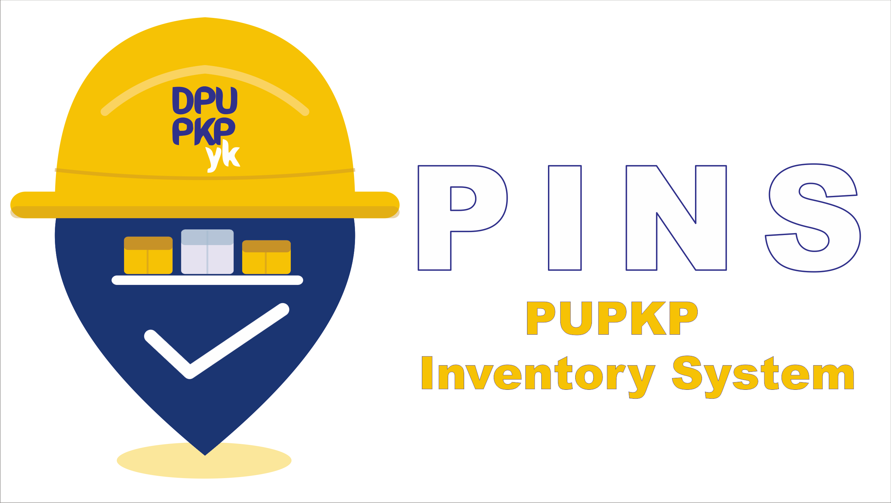

<!-- HERO -->
<p align="center">
  
</p>

<h1 align="center">PINS</h1>
<p align="center">
  <sub><b>PUPKP Inventory System</b></sub>
</p>

<p align="center">
  Sistem inventaris barang dan suku cadang untuk mendukung operasional<br>
  Dinas PUPKP Kota Yogyakarta.
</p>

<p align="center">
  
  
  
  
</p>

---

## 📦 Tentang PINS

**PINS** membantu pengelolaan inventaris secara terpusat, mulai dari pencatatan barang dan stok, distribusi antar-gudang, transaksi masuk dan keluar, hingga pelaporan. Setiap gudang dikelola di bawah bidang atau UPT tertentu, sehingga cakupan akses pengguna selaras dengan struktur organisasi Dinas PUPKP. Antarmuka dibuat responsif agar nyaman digunakan melalui komputer, tablet, maupun perangkat Android.

## ✨ Fitur Utama

| Modul | Fungsi |
|---|---|
| 📊 Dashboard | Menampilkan ringkasan stok dan aktivitas inventaris |
| 📦 Barang | Mengelola data barang, stok, kategori, dan identitas aset |
| 🔄 Transaksi | Mencatat barang masuk, keluar, dan perpindahan gudang |
| 🏢 Bidang | Mengelola bidang dan UPT sebagai unit pengelola inventaris |
| 🏪 Gudang | Mengelola lokasi penyimpanan yang terhubung ke bidang/UPT |
| 📷 QR Scanner | Membuat serta memindai QR code barang |
| 📑 Laporan | Menyajikan dan mengekspor data inventaris |
| 👥 Pengguna | Mengelola akun, peran, dan cakupan akses |
| 📱 Android | Mendukung penggunaan melalui aplikasi berbasis Capacitor |

## 🚀 Petunjuk Penggunaan

1. Masuk menggunakan NIP dan password yang telah diberikan administrator.
2. Buka **Dashboard** untuk melihat ringkasan data inventaris.
3. Gunakan menu **Barang** untuk mencari, menambah, atau memperbarui data barang sesuai hak akses.
4. Gunakan menu **Transaksi** untuk mencatat barang masuk, keluar, atau berpindah gudang.
5. Gunakan **QR Scanner** untuk mempercepat identifikasi barang.
6. Buka **Laporan** untuk meninjau dan mengekspor data.
7. Gunakan menu profil untuk mengganti password dan foto pengguna.

> Menu dan tindakan yang tersedia menyesuaikan peran serta unit kerja pengguna.

## 🔐 Hak Akses

| Peran | Cakupan |
|---|---|
| **Super Admin** | Seluruh bidang, gudang, master data, dan manajemen pengguna |
| **Admin Bidang** | Seluruh gudang dalam bidang/UPT yang ditetapkan |
| **Admin Gudang** | Gudang yang ditugaskan kepada pengguna |
| **Hanya Baca** | Pemantauan dan verifikasi tanpa mengubah data |

> Super Admin dapat menambah, mengubah, dan menghapus bidang maupun gudang secara independen. Setiap gudang wajib diasosiasikan ke satu bidang/UPT.

## 🧰 Teknologi

- **Web** — Next.js 16, React 19, Tailwind CSS 4.
- **Data & Auth** — Supabase PostgreSQL, Authentication, Storage, dan Row Level Security.
- **Dokumen** — jsPDF, SheetJS/XLSX, dan QR Code.
- **Mobile** — Capacitor 8 untuk Android.

## 💻 Instalasi Lokal

### Persyaratan

- Node.js 20 atau versi LTS yang kompatibel.
- NPM.
- Proyek Supabase dengan skema database PINS.

### Langkah instalasi

```bash
git clone https://github.com/e-listo/pins.git
cd pins
npm ci
```

Buat file `.env.local`:

```env
NEXT_PUBLIC_SUPABASE_URL=<project-url>
NEXT_PUBLIC_SUPABASE_ANON_KEY=<anon-key>
SUPABASE_SERVICE_ROLE_KEY=<service-role-key>
```

Jalankan aplikasi:

```bash
npm run dev
```

Kemudian buka [http://localhost:3000](http://localhost:3000).

> `SUPABASE_SERVICE_ROLE_KEY` hanya digunakan oleh proses server. Jangan menambahkan awalan `NEXT_PUBLIC_` dan jangan menyimpan file environment ke repository.

## ✅ Pemeriksaan

Sebelum membuat pull request atau melakukan deployment:

```bash
npm run lint
npm run build
```

Lakukan pemeriksaan singkat pada login, dashboard, barang, transaksi, bidang, gudang, laporan, QR scanner, dan manajemen pengguna.

## 🗄️ Database

Migrasi database tersedia pada `db/migrations/` dan dijalankan sesuai urutan setelah backup:

```text
00_preflight.sql
01_konsolidasi_tabel.sql
02_normalisasi_peran_rls.sql
03_verify_migration.sql
```

Dokumentasi tambahan:

- [Runbook Migrasi](db/MIGRATION_RUNBOOK.md)
- [Audit peran dan hak akses](db/AUDIT_ROLE.md)
- [Keamanan Supabase Admin](docs/SECURITY_SUPABASE_ADMIN.md)

## 📱 Android

Setelah konfigurasi web siap, sinkronkan proyek Android:

```bash
npm run build
npx cap sync android
npx cap open android
```

App ID: `id.go.jogjakota.pupkp.pins`

## 📁 Struktur Proyek

```text
pins/
├── app/                # Halaman dan endpoint Next.js
├── src/components/     # Komponen dan modul aplikasi
├── src/lib/            # Autentikasi, Supabase, dan hak akses
├── db/migrations/      # Migrasi database
├── docs/               # Dokumentasi teknis
├── public/             # Logo dan aset publik
└── android/            # Proyek Android Capacitor
```

## 🛠️ Progress

- [x] Modul inventaris, transaksi, kategori, laporan, QR, dan pengguna.
- [x] Modul Bidang dan Gudang sebagai entitas terpisah yang saling terasosiasi.
- [x] Antarmuka responsif untuk desktop dan perangkat lapangan.
- [x] Normalisasi peran serta pemusatan aturan hak akses.
- [x] Pengamanan operasi administratif Supabase pada sisi server.
- [ ] Validasi deployment dan environment produksi.
- [ ] Pengujian menyeluruh seluruh peran dan alur transaksi.
- [ ] Finalisasi distribusi aplikasi Android.

## 🤝 Kontribusi

1. Buat branch dari `main` menggunakan awalan `feat/`, `fix/`, atau `docs/`.
2. Lakukan perubahan yang terfokus.
3. Jalankan lint, build, dan pemeriksaan fungsi terkait.
4. Buat pull request ke `main` dengan ringkasan perubahan dan cara pengujian.

## 🏛️ Pengelola

Dikembangkan untuk mendukung pengelolaan inventaris di lingkungan **Dinas PUPKP Kota Yogyakarta**.

---

<p align="center">
  <b>PINS · PUPKP Inventory System</b><br>
  <sub>Dinas PUPKP Kota Yogyakarta</sub>
</p>
